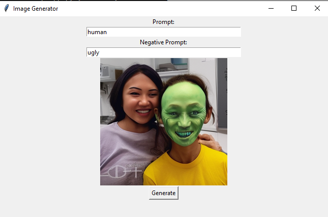

**StableDifDesktop** - Приложение для генерации изображений.
Приложение имеет 2 поля ввода для промпта и негативного промпта, кнопку генерации и поле для самого изображения.

## Как это сделано

**StableDifDesktop** использует модель от Stable Diffusion из репозитория https://github.com/Stability-AI/stablediffusion. Саму модель можно найти тут: https://huggingface.co/stabilityai/stable-diffusion-2-1-base.

## Как запустить приложение

1. Установить все необходимые библиотеки (requirements.txt).
2. Запустить скрипт app.py

После этого будет скачана модель и запустится приложение. 

### Пример работы

### Итоговый файл

Сгенерированное изображение будет лежать по пути `res/generation.png`.
